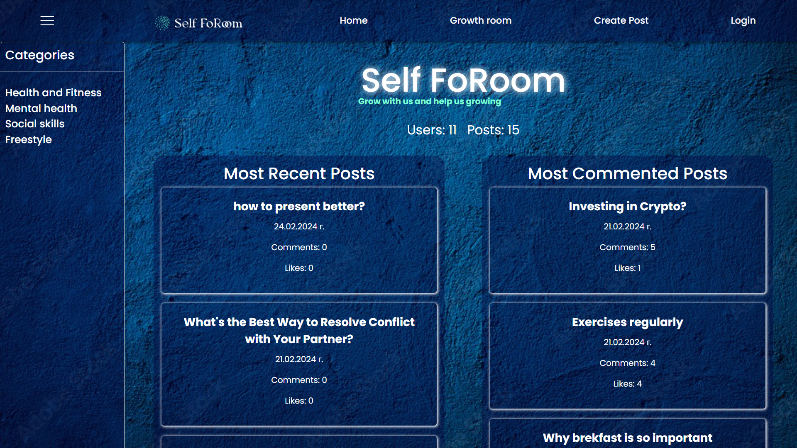
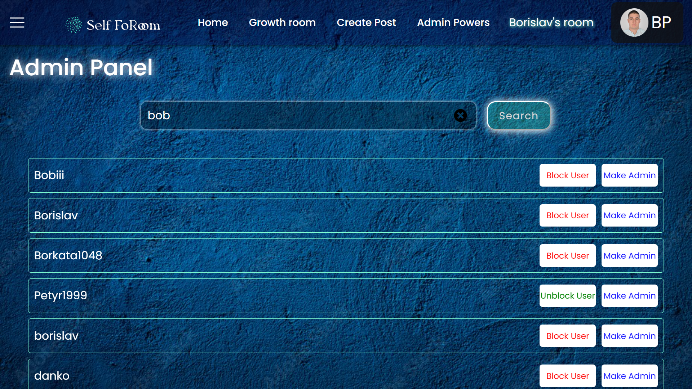
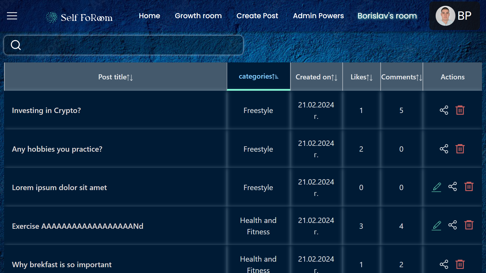
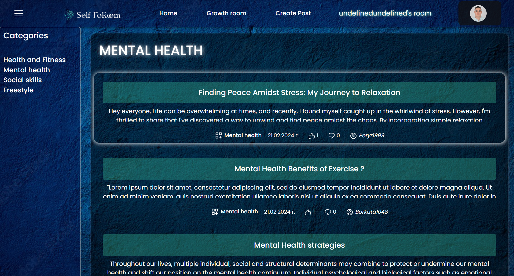
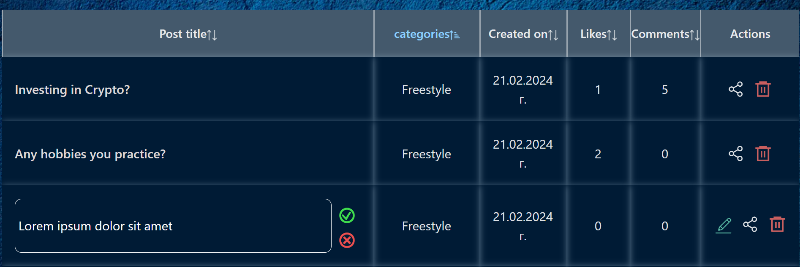
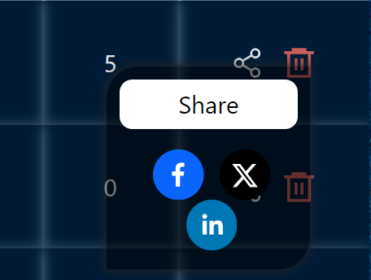
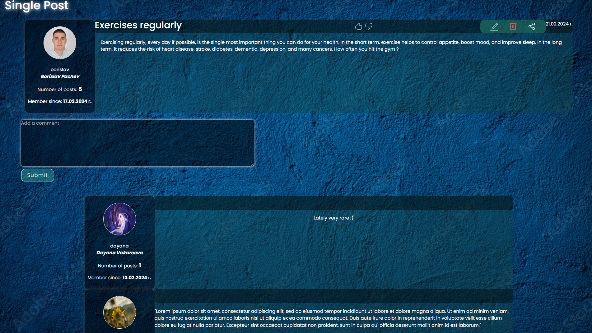
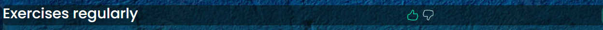
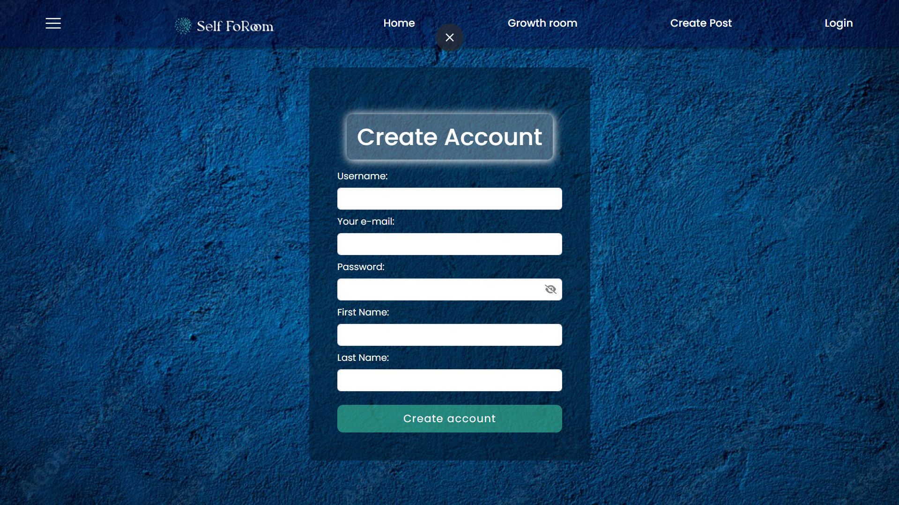
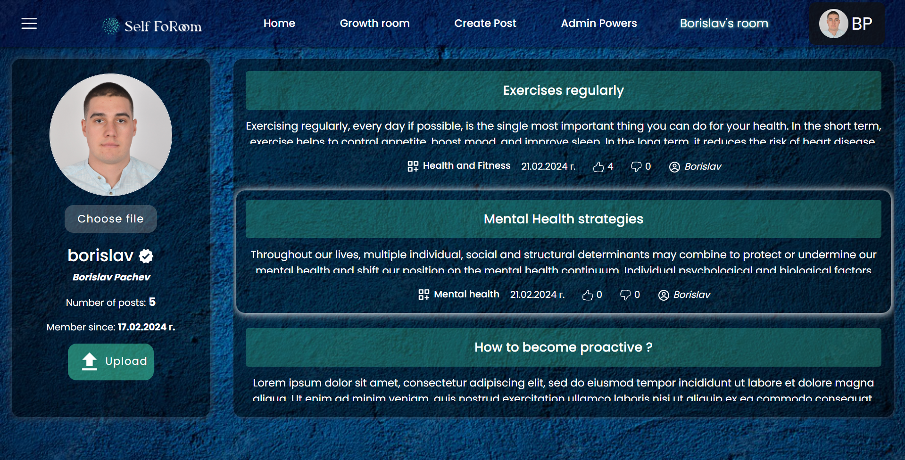

# Self FoRoom Documentation

Welcome to the SelfFoRoom, a platform dedicated to personal growth and self-improvement. Our motto is: **Grow with us and help us growing**.

## 1. Overview

This forum is designed to provide a community space where users can share their personal growth journeys, seek advice, and support others. The backend and authentication are powered by Firebase.
<br>



## 2. Project information

- Language and version: JavaScript ES2020
- Platform and version: Node 14.0+

## 3. Features

### Admin Panel

<br>



- **Block Users:** Admins can block users who violate community guidelines.
- **Delete Posts:** Admins can delete posts that are inappropriate or violate rules.
- **Manage Admins:** Admins can assign other users as admins to help manage the community.

### Post Management

- **Table for Searching, Sorting, and Editing Posts:** Users can easily find and manage posts with advanced search and sort functionalities.
  <br>

  
- **Post Categories:** Users can write posts in specific categories related to personal growth.
  <br>

  
- **Post Editing:** Users can edit or delete their own posts.
  <br>

  

- **Post Sharing:** Users can easily share posts on their social media.
  <br>

  

- **Comments:** Users can add comments to posts to share feedback or advice.
<br>
  
  
- **Likes:** Users can like posts to show their appreciation.
<br>

  

### User Management

- **User Authentication:** Authentication is handled by Firebase, ensuring secure login and registration.
  <br>

  
- **Profile Management:** Users can manage their profiles and update their personal information.
  <br>
  
  

## 4. Tech Stack

- **Frontend:** Vite + React
- **Backend:** Firebase
- **Authentication:** Firebase Authentication

## 5. Getting Started

To get started with the project, follow these steps:

1. **Clone the repository:**

   ```bash
   git clone https://github.com/WEB-Team-9-BDD/Forum-React-App.git
   cd client
   ```

2. Install the dependencies: npm install
3. Start the server : npm run dev
4. Open your browser and visit http://localhost:5173.

## 6.Authors

Self FoRoom was made by the following team:

- Borislav Pachev https://github.com/borislavpachev
- Dayana Vakareeva https://github.com/DayanaVakareeva
- Danko Dankov https://github.com/DDankov
